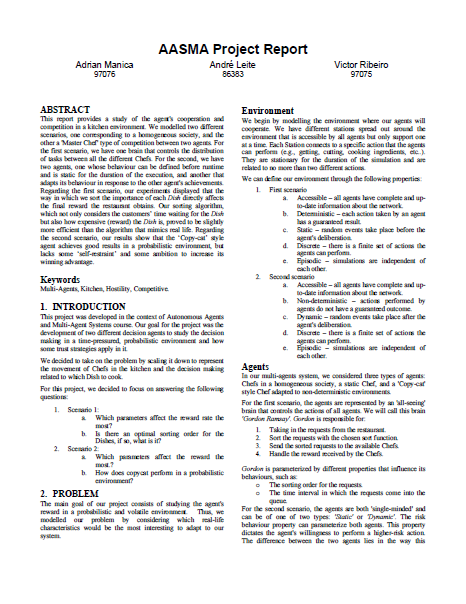
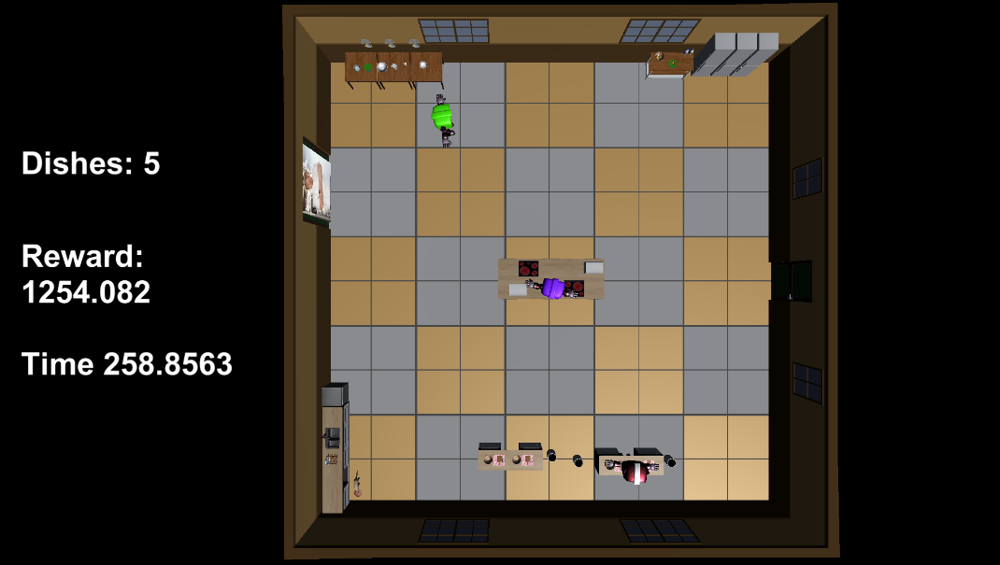

## Kitchen Hell

A simulation developed for the 2019/2020 edition of the AASMA course at IST (Instituto Superior Técnico).

### Description

This simulation provides a study of the agent's cooperation and competition in a kitchen environment.
We modelled two different scenarios, one corresponding to a homogeneous society, and the other a 'Master Chef' type of competition between two agents.

### Report

#### Youtube Video

